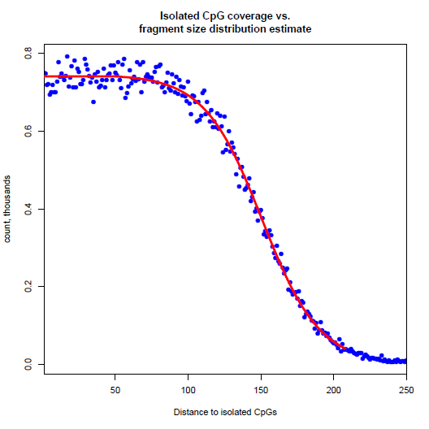
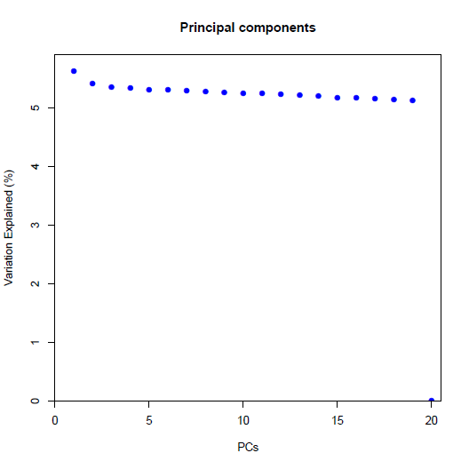
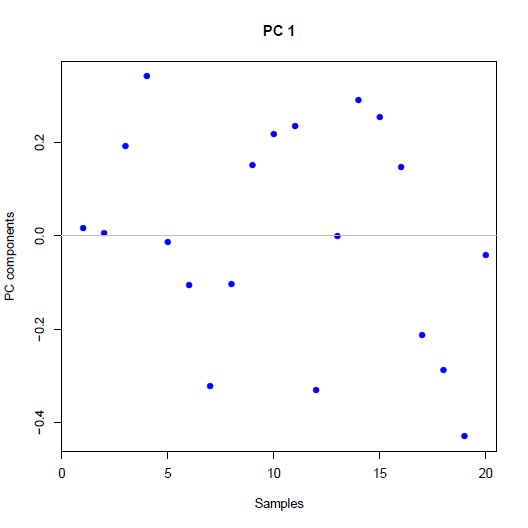
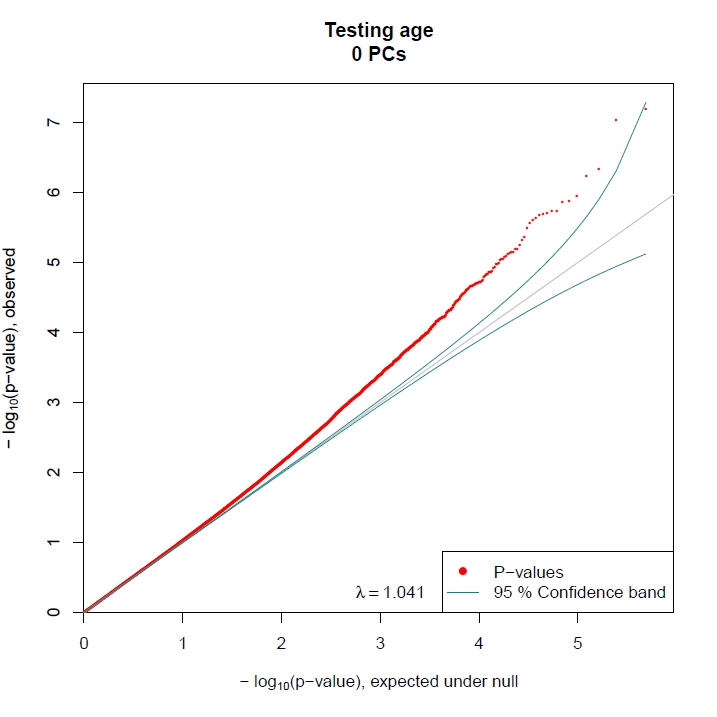
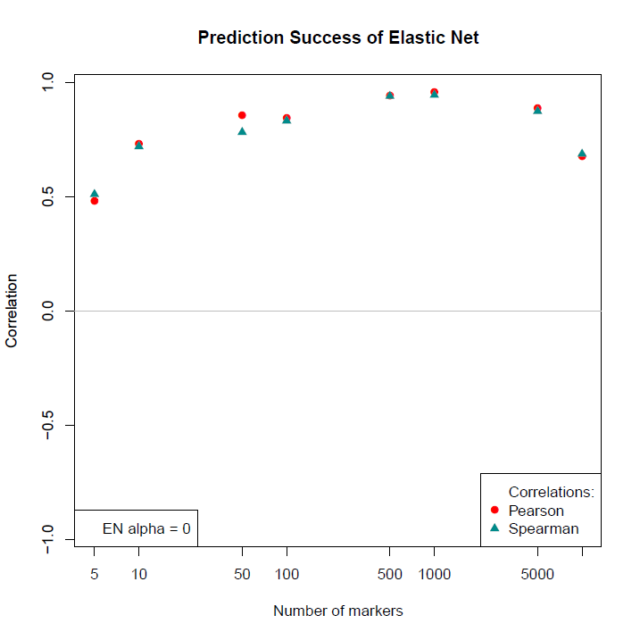

```{r switcher, echo=FALSE}
library("knitr")
# opts_chunk$set(eval=FALSE)
```

# Introduction

[RaMWAS](http://www.bioconductor.org/packages/devel/bioc/html/ramwas.html)
provides a complete toolset for methylome-wide association studies (MWAS).
It is specifically designed for data from enrichment based methylation assays,
but can be applied to other methylomic data as well.

The analysis pipeline includes seven steps:

1. Scanning aligned reads from BAM files
2. Calculation of quality control measures
3. Creation of methylation score (coverage) matrix
4. Principal component analysis for capturing batch effects and
   detection of outliers
5. Association analysis with respect to phenotypes of interest
   while correcting for top PCs and known covariates
6. Annotation of significant findings
7. Multi-marker analysis (methylation risk score) using elastic net

Most steps of RaMWAS are internally parallelized.
This is made possible, in part, by the use of
[filematrix](https://cran.r-project.org/web/packages/filematrix/index.html)
package for storing the data and accessing it in parallel jobs.

# Getting Started

## Installation

RaMWAS can be installed with the following commands.

```{r install, eval=FALSE}
## try http:// if https:// URLs are not supported
source("http://bioconductor.org/biocLite.R")
biocLite("ramwas")
```

## Loading Package and Viewing Documentation

The package vignettes and reference manual can be viewed
[online](http://www.bioconductor.org/packages/devel/bioc/html/ramwas.html)
and with following commands.

```{r loadIt, eval=FALSE}
library(ramwas) # Loads the package
browseVignettes("ramwas") # Opens vignettes
help(package="ramwas") # Lists package functions
```

# Steps of the Pipeline

To illustrate the workflow of RaMWAS we need a data set,
so we create an artificial data with this simple call.

```{r loadPackages, echo=FALSE, warning=FALSE, message=FALSE, eval=TRUE}
suppressPackageStartupMessages(library(ramwas))
```

```{r generateData, warning=FALSE}
library(ramwas)
dr = paste0(tempdir(), "/simulated_project")
ramwas0createArtificialData(dir = dr, verbose = FALSE)
# This is the project directory
cat(dr)
```
**Note.** One may choose to set the project directory `dr` to
a more convenient location when running this code.


Now the project directory `dr` contains

* `bams` -- directory with the 20 simulated BAM files
* `bam_list.txt` -- file with names of all the BAM files
* `covariates.txt` -- file with age and sex variables for the samples.\
The methylation level of some CpGs
is generated to depend on the covariates.
* `Simulated_chromosome.rds` - file with locations of all CpGs.
See [CpG set vignette](RW4_CpG_sets.html) for more information.

Each RaMWAS step accepts parameters in the form of a list with named elements.
Here is the parameter list we will use for all steps below.
```{r parameters, eval=TRUE}
param = list(
    dirproject = dr,
    dirbam = "bams",
    filebamlist = "bam_list.txt",
    filecpgset = "Simulated_chromosome.rds",
    cputhreads = 2,
    scoretag = "MAPQ",
    minscore = 4,
    minfragmentsize = 50,
    maxfragmentsize = 250,
    minavgcpgcoverage = 0.3,
    minnonzerosamples = 0.3,
    filecovariates = "covariates.txt",
    modelcovariates = NULL,
    modeloutcome = "age",
    modelPCs = 0,
    toppvthreshold = 1e-5,
    bihost = "grch37.ensembl.org",
    bimart = "ENSEMBL_MART_ENSEMBL",
    bidataset = "hsapiens_gene_ensembl",
    biattributes = c("hgnc_symbol","entrezgene","strand"),
    bifilters = list(with_hgnc_transcript_name=TRUE),
    biflank = 0,
    cvnfolds = 10,
    mmalpha = 0,
    mmncpgs = c(5,10,50,100,500,1000,5000,10000)
)
```
The meaning of the parameters will be described as they are used below.

## Scan BAM Files

This step scans all BAM files listed in `filebamlist` file
and calculates a number of quality control metrics.
The BAMs must be located in `dirbam` directory (relative to `dirproject`).

The reads are filtered by `scoretag` parameter,
which is usually the "MAPQ" field or "AS" tag in the BAM file
([BAM file format](https://samtools.github.io/hts-specs/SAMv1.pdf)).
The `minscore` parameter defines the minimum admissible score,
reads with scores below that are excluded.

The `minfragmentsize` and `maxfragmentsize` parameters define
the minimum and maximum size of DNA fragments that were sequenced.
Please note, these parameters are not equal to the read length but
instead reflect the length of the DNA fragments that were
extracted and sequenced. Thus, these parameters are determined by
labtechnical factors such as fragmentation procedure and size selection.

The set of CpGs is loaded from `filecpgset` file.

BAM scanning is run in `cputhreads` parallel jobs.

```{r scan-bams, warning=FALSE, message=FALSE}
ramwas1scanBams(param)
```

This creates the following subdirectories in the project directory:

* `qc` -- directory with a number of (quality control) QC plots.
    * `edit_distance` -- plots showing distribution of edit distance, i.e.
    number of mismatches between the read and the reference genome,
    one plot per BAM.
    * `isolated_distance` -- plots showing distribution of distances
    from read starts to isolated CpGs, one plot per BAM. \
    The CpGs are called isolated if they are located at least `maxfragmentsize`
    basepairs away from other CpGs.
    The distribution of reads around these CpGs is used later
    for estimation of fragment size distribution.
    * `matched_length` -- plots showing distribution of the length of the
    reads aligned to the reference genome, one plot per BAM.
    * `score` -- plots showing distribution of the score (`scoretag` parameter),
    one plot per BAM.
    * `coverage_by_density` -- plots showing average coverage at
    a function of CpG density, one plot per BAM.\
    These plots illustrate the performance of enrichment protocol.
    It is a sign of good quality data if the shape of these
    plots is the same across BAMs.
* `rds_rbam` and `rds_qc` -- directories with RaMWAS raw files
(BAM read start locations) and BAM quality control metrics,
one RDS file per BAM.

**Note.** For the full information on BAM-wise QC, see
[RW3_BAM_QCs.html](BAM QC vignette).

Here is a sample `coverage_by_density` plot for the simulated data.\
It shows higher average coverage for regions
with higher CpG densities, up to rather high CpG density level.


**Note.** The BAM files are no longer needed after this step.\
**Note.** If a BAM has already been scanned before, it is not processed again.
This way it is easy to rerun Step 1 when additional samples have been sequenced.

## Collect QC Measures, Summarize by Samples

This step aggregates quality control metrics across all scanned BAM files,
produces a number of summary plots, and estimates fragment size distribution.

In this example, each BAM corresponds to one sample with the same name.
When multiple BAMs contain data from a single sample,
`filebam2sample` parameter is used to instruct RaMWAS
about the bam to sample matching.

```{r collectQC1, warning=FALSE, message=FALSE}
ramwas2collectqc(param)
```

The following files and directories are created in the project directory:

* `Fragment_size_distribution.txt` -- text file with estimated
fragment size distribution.
* `qc/Fragment_size_distribution_estimate.pdf` -- plot showing both
estimated fragment size distribution and the distribution of distances
from read starts to isolated CpGs.\
* Four sub-directories in the "qc" directory
    + `summary_bams` -- by BAMs
    + `summary_bams_in_bam2sample` -- by BAMs,
    but only those listed in `filebam2sample` parameter
    + `summary_by_sample` -- by sample
    + `summary_total` -- total across all BAMs.
* The directories listed above contain
    - `Summary_QC.txt` -- table with a number of numerical QC measures,
    in an Excel friendly format.
    - `Summary_QC_R.txt` -- table with a number of numerical QC measures,
    in an R friendly format.
    - `qclist.rds` -- an R file with list of QC objects.
    - `Fig_hist_*.pdf` -- histograms of several QC measures across samples.
    - `Fig_*.pdf` -- PDF files with various QC plots,
    one page per BAM or sample,
    depending on the directory.

Here is an example of a good fit of estimated fragment size distribution.


**Note.** The fragment size distribution is estimated using all BAMs in
`filebam2sample` parameter (if defined).


## Calculate Methylation Score (Coverage) Matrix

This step creates a coverage matrix, with measurements of local
methylation for all samples and all CpGs in the CpG set.
The CpGs with low coverage are excluded based on two criteria.

* A CpG must have average equal or greater than the user specified
thresholds `minavgcpgcoverage` (default is 0.3).
* A CpG must have at least `minnonzerosamples` proportion of samples
with nonzero coverage\
  (default is 0.3, i.e. a CpG is preserved if at least 30\% of samples
  have non-zero coverage).

The matrix is normalized to have the same average coverage for each sample.\

```{r normCoverage99, warning=FALSE, message=FALSE}
ramwas3normalizedCoverage(param)
```

This step creates directory `coverage_norm_20` in the project directory
(20 is the number of samples, see [Directory names][]) with the following files:

* `Coverage.*` - filematrix with the coverage for all samples and all
CpGs that passed the threshold.\
  Each row has coverage for a single sample.\
  Each column has coverage for a single CpG.
See
[`filematrix`](https://cran.r-project.org/web/packages/filematrix/index.html)
package for format details.
* `CpG_locations.*` - filematrix with the location of the CpGs
that passed the threshold.\
It has two columns - `chr` and `position`.
* `CpG_chromosome_names.txt` - file with chromosome names (factor levels)
for the integer column `chr` in `CpG_locations.*` filematrix.
* `raw_sample_sums.*` - filematrix with total coverage for each
sample before normalization.

<!-- **Note.** The temporary files are located in `dirtemp` directory, -->
<!-- which is "temp" sub-directory of `dircoveragenorm` by default. -->
<!-- For better performance for large projects set `dirtemp` to a -->
<!-- location on another hard drive. -->


## Principal Component Analysis

RaMWAS can perform principal component analysis (PCA) on the coverage matrix.

PCA has two benefits.
First, it can capture main directions of variation in the data
(after regressing out covariates). We correct for them in the
next steps of the analysis.
Second, the sample loadings of the first PCs can indicate
highly irregular samples which should be excluded.

The analysis can exclude variation explained by known
covariates by regressing them out from the coverage before PCA.
The covariates can be stored as a file `filecovariates` in a
tab-separated table format, with sample names in the first column.
The artificial data set includes covariate file *covariates.txt*.

The parameter `modelcovariates` names
the covariates regressed out for before PCA.

```{r pca99, warning=FALSE, message=FALSE}
ramwas4PCA(param)
```

This step creates sub-directory `PCA_00_cvrts` in the directory with
score matrix.\
The name of the sub-directory depends on the covariates
(see [Directory names][]).
The sub-directory includes:

* `covmat.rds` and `eigen.rds` - RDS files with covariance matrix and
its eigenvalue decomposition.
* `PC_values.txt` - principal components scores.
* `PC_loadings.txt` - sample loadings for the top 20 PCs.
* `PC_plot_covariates_removed.pdf` - plots of principal components scores
(i.e. \% variance explained, page 1) and
sample loadings for the top 40 PCs (pages 2+).
* `PC_vs_covariates_corr.txt` - correlations of principal components
with phenotypes/covariates (from `filecovariates` file).
* `PC_vs_covariates_pvalue.txt` - p-values for these correlations.

The PC plot for artificial data shows no strong components and
no outliers in the sample loadings:


However, there is strong correlation of top PCs with age and sex.

name | age | sex
:---:|---:|---:
PC1 |  0.961 | 0.301
PC2 | -0.104 | 0.812
... | ... | ...

Table: Correlations\ in\ `PC_vs_covariates_corr.txt`\ file.

name | age | sex
:---:|---:|---:
PC1 | 1.8x10^-11^ | 0.20
PC2 | 0.66 | 1.4x10^-5^
... | ... | ...

Table: Significance\ in\ `PC_vs_covariates_pvalue.txt`\ file.

## Methylome-wide Association Study (MWAS)

This step performs tests for association
between normalized coverage and the
outcome variable named by `modeloutcome` parameter.
The analysis corrects for covariates listed in `modelcovariates`
parameter and top `modelPCs` principal components.
The testing is performed using linear regression model.

All results are saved in a filematrix.
Findings passing `toppvthreshold` p-value threshold are recorded in a text file.

```{r mwas99, warning=FALSE, message=FALSE}
ramwas5MWAS(param)
```

This step creates a sub-directory in the PCA directory named
`Testing_casecontrol_0_PCs`. The name depends on `modeloutcome` and `modelPCs`
(see [Directory names][]).
The sub-directory includes:

* `QQ_plot.pdf` -- QQ-plot with confidence band and inflation factor.
* `Top_tests.txt` -- text file with top findings.
* `Stats_and_pvalues.*` -- filematrix with MWAS results.
The columns include test statistic, p-value, and q-value.
The rows match the CpGs of the coverage matrix.
* `DegreesOfFreedom.txt` -- file with the numbers of degrees of freedom for
the t- or F test used for testing.

For the simulated data the QQ-plot for age shows moderate deviation from the
diagonal for many CpGs. This is consistent with how the data was generated --
there is weak signal in 1\% of CpGs.


## Annotation of top results

RaMWAS can annotate top findings using data from
[`biomaRt`](https://bioconductor.org/packages/release/bioc/html/biomaRt.html).

The parameters include:

* `bihost` -- biomart host site.
* `bimart` -- BioMart database name, see listMarts().
* `bidataset` -- data set, see listDatasets().
* `biattributes` -- are attributes of interest, see listAttributes().
* `bifilters` -- lists filters (if any), see listFilters().
* `biflank` -- indicates the maximum allowed distance from the
CpG to the annotation element.

ere we annotate top findings with human gene symbols, gene ids, and
strand information.

```{r anno, warning=FALSE, message=FALSE}
ramwas6annotateTopFindings(param)
```

The function overwrites `Top_tests.txt` file in MWAS directory.


chr | position | tstat | pvalue | qvalue | hgnc_symbol | entrezgene | strand
:---:|---:|---:|---:|---:|:---:|:---:|:---:
chr1 | 15,975,530 |  8.771 | 6.446x10^-8^ | 0.022 | DDI2/DDI2 | 84301/6248 | 1/1
chr1 | 15,975,533 |  8.568 | 9.097x10^-8^ | 0.022 | DDI2/DDI2 | 84301/6248 | 1/1
chr1 | 15,418,248 | -7.654 | 4.571x10^-7^ | 0.071 | KAZN | 23254 | 1

Table: Top\ of\ `Top_tests.txt`\ file.

## Methylation Risk Score (Cross-validation of Elastic Net Prediction)

RaMWAS can assess performance of
elastic net applied to the top MWAS sites
via N-fold cross-validation.

RaMWAS predicts the outcome variable (`modeloutcomes` parameter)
using top `mmncpgs` CpGs from the MWAS.
If the `mmncpgs` is set to a vector of several values,
each number of CpGs is tested and the results are aggregated.

The elastic net parameter alpha can be set via `mmalpha` parameter.
The number of folds `cvnfolds` in the N-fold cross validation is 10 by default.

```{r parameters7, warning=FALSE, message=FALSE}
ramwas7riskScoreCV(param)
```

This creates `CV_10_folds` sub-directory in MWAS directory
(see [Directory names][]).
It contains:

* `fold_*` -- directories with MWAS on 90\% of the data,
each with different 10% of the samples excluded from the analysis.
* `MMCVN_prediction_folds=10_CpGs=*.txt` -
the table with true outcome and cross-validation prediction.
* `MMCVN_prediction_folds=10_CpGs=*.pdf` -
scatter-plot of true outcome vs. cross-validation prediction.
* `Prediction_alpha=0.000000.pdf` -- scatter plot of
outcome-prediction correlations as a function of the
number of CpGs used for prediction.

For the simulated data
we get moderately good prediction
using just 10 top CpGs.


The correlation of prediction with
actual age is maximal when we use 1,000
top CpGs in elastic net.



# Directory names

The names of coverage/PCA/MWAS/MMCV directories can be recovered
by first calling `parameterPreprocess` function.

```{r dirlocations, eval=TRUE}
fullparam = parameterPreprocess(param)
# Here lies coverage matrix
fullparam$dircoveragenorm
# Here are PCA files
fullparam$dirpca
# Here are MWAS files
fullparam$dirmwas
# Here are multi-marker cross-validation files
fullparam$dircv
```

## Cleanup

Here we remove all the files created by the code above.
```{r clean}
unlink(paste0(dr,"/*"), recursive=TRUE)
```

# Version information
```{r version, eval=TRUE}
sessionInfo()
```


