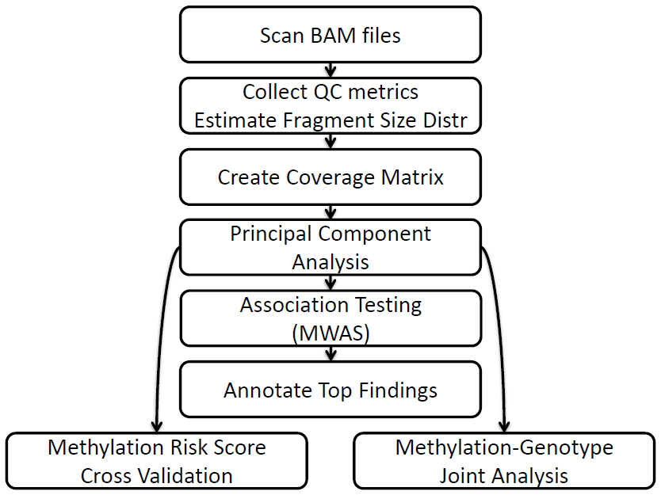

```{r loadKnitr, echo=FALSE}
library("knitr")
# opts_chunk$set(eval = FALSE)
opts_chunk$set(fig.width = 6, fig.height = 6)
library(pander)
panderOptions("digits", 3)
```

# Introduction

[RaMWAS](https://bioconductor.org/packages/ramwas/)
provides a complete toolset for methylome-wide association studies (MWAS).
It is primarily designed for data from enrichment-based methylation assays,
but can be applied to other methylomic data
(e.g. Illumina methylation array) as well as other data types like
gene expression and genotype data
([see vignette](RW5_matrix.html)).

RaMWAS includes the following major components (steps):

1.  Scanning aligned reads from BAM files.
2.  Calculation of quality control (QC) measures, aggregate QC plots,
    fragment size distribution estimation.
3.  Creation of CpG score (coverage) matrix, sample normalization.
4.  Principal component analysis.
5.  Methylome-wide association study (MWAS).
6.  Annotation of top findings using the BioMart database.
7.  Multi-marker analysis (methylation risk score) using elastic net.
8.  MWAS with correction for effect of SNPs.

Most steps of RaMWAS are internally parallelized.
This is made possible, in part, by the use of the
[filematrix](https://CRAN.R-project.org/package=filematrix)
package for storing the data and accessing it in parallel jobs.

# Getting started

## Installation


To install the most recent version of RaMWAS please follow instructions
at [GitHub.com](https://github.com/andreyshabalin/ramwas) 
(R 3.3 or newer required).  \
To install the Bioconductor version of RaMWAS (R 3.4 or newer requred)
use the following commands:
```{r install, eval=FALSE}
## try http:// if https:// URLs are not supported
if (!requireNamespace("BiocManager", quietly=TRUE))
    install.packages("BiocManager")
BiocManager::install("ramwas")
```

## Loading package and viewing documentation

The package vignettes and reference manual can be viewed
[online](https://bioconductor.org/packages/ramwas/)
and with the following commands.

```{r loadIt, eval=FALSE}
library(ramwas) # Loads the package
browseVignettes("ramwas") # Opens vignettes
help(package = "ramwas") # Lists package functions
```

# RaMWAS steps



To illustrate the main steps of RaMWAS
we first create an artificial data set.

```{r loadPackages, echo=FALSE, warning=FALSE, message=FALSE}
suppressPackageStartupMessages(library(ramwas))
# dr = "D:/temp"
```

```{r generateData, warning=FALSE, message=FALSE}
library(ramwas)
dr = paste0(tempdir(), "/simulated_project")
ramwas0createArtificialData(
            dir = dr,
            nsamples = 20,
            nreads = 100e3,
            ncpgs = 25e3,
            threads = 2)
cat("Project directory:", dr)
```
**Note.** The project directory `dr` can be set to
a more convenient location when running the code.

The function `ramwas0createArtificialData` created the following files
and subdirectories in the project directory.

*   `bams` -- directory with 20 BAM files
*   `bam_list.txt` -- file with names of all the BAM files
*   `covariates.txt` -- file with 
    age and sex variables for the samples.\
    The methylation level of some CpGs depends on these covariates.
*   `Simulated_chromosome.rds` - file with genomic locations for all CpGs.\
See [CpG set vignette](RW2_CpG_sets.html) for more information.

Each RaMWAS step accepts parameters in the form of a list.
Here is the parameter set we will use for all steps below.
```{r parameters}
param = ramwasParameters(
    dirproject = dr,
    dirbam = "bams",
    filebamlist = "bam_list.txt",
    filecpgset = "Simulated_chromosome.rds",
    cputhreads = 2,
    scoretag = "MAPQ",
    minscore = 4,
    minfragmentsize = 50,
    maxfragmentsize = 250,
    minavgcpgcoverage = 0.3,
    minnonzerosamples = 0.3,
    filecovariates = "covariates.txt",
    modelcovariates = NULL,
    modeloutcome = "age",
    modelPCs = 0,
    toppvthreshold = 1e-5,
    bihost = "grch37.ensembl.org",
    bimart = "ENSEMBL_MART_ENSEMBL",
    bidataset = "hsapiens_gene_ensembl",
    biattributes = c("hgnc_symbol","entrezgene","strand"),
    bifilters = list(with_hgnc_trans_name = TRUE),
    biflank = 0,
    cvnfolds = 5,
    mmalpha = 0,
    mmncpgs = c(5, 10, 50, 100, 500, 1000, 2000)
)
```
We describe the role of each parameter as they are used below.
The complete description of all RaMWAS parameters
is available in the [parameter vignette](RW6_param.Rmd).

## Scan BAM files and calculate QC indices {#step1}

This step scans all BAM files listed in the `filebamlist` file,
it records read start locations,
and calculates a number of quality control metrics.
The BAMs must be located in `dirbam` directory.

Reads are filtered by the `scoretag` parameter,
which is usually either the "MAPQ" field or "AS" tag in the BAM file
(see [BAM file format](https://samtools.github.io/hts-specs/SAMv1.pdf)).
Reads with scores below `minscore` are excluded.

The `minfragmentsize` and `maxfragmentsize` parameters define
the minimum and maximum size of DNA fragments that were sequenced.
Please note, these parameters are not equal to the read length but
instead reflect the length of the DNA fragments that were
extracted and sequenced.

The set of CpGs is loaded from the `filecpgset` file.
For more information see the [CpG set vignette](RW2_CpG_sets.html).

RaMWAS uses `cputhreads` CPU cores (parallel jobs) to scan BAMs.
Hard disk speed can be a bottleneck for this step.
If BAMs are stored on a single rotational hard drive,
using more than 4 parallel jobs may not provide further speed improvements.


```{r scan-bams, warning=FALSE, message=FALSE}
ramwas1scanBams(param)
```

This creates the following subdirectories in the project directory:

*   `qc` -- directory with a number of quality control (QC) plots, 
    one plot per QC metrix per BAM.\
    For more information see [BAM QC vignette](RW3_BAM_QCs.html).
    *   `edit_distance` -- plots showing distribution of edit distance, i.e.
        number of mismatches between the aligned read and the reference genome.
    *   `isolated_distance` -- plots showing distribution of distances
        from read starts to isolated CpGs. \
        The CpGs are called isolated if they are located at least 
        `maxfragmentsize` basepairs away from any other CpG.\
        The distribution of reads around these CpGs is used later
        for estimation of fragment size distribution.
    *   `matched_length` -- plots showing distribution of the length of the
        reads aligned to the reference genome.
    *   `score` -- plots showing distribution of the score 
        (`scoretag` parameter).
    *   `coverage_by_density` -- plots showing average CpG score (coverage) as
        a function of CpG density.\
        These plots illustrate the performance of the enrichment protocol.
        It is a sign of a stable protocol if the shape of these
        plots is the same across BAMs.
*   `rds_rbam` and `rds_qc` -- directories with RaMWAS BAM info files
    (BAM read start locations) and BAM quality control metrics,
    one RDS file per BAM.

Here is a `coverage_by_density` plot for the simulated data.
It shows higher average CpG score (fragment coverage) for regions
with higher CpG densities, up to the saturation point.

```{r plotACbD, warning=FALSE, message=FALSE}
pfull = parameterPreprocess(param)
qc = readRDS(paste0(pfull$dirrqc, "/BAM007.qc.rds"))
plot(qc$qc$avg.coverage.by.density)
```

**Note.** If a BAM file has previously been scanned,
it will not be scanned again in subsequent calls of `ramwas1scanBams`.
This way Step 1 can be rerun multiple times 
to efficiently include additional BAMs (samples) when they become available.\
**Note.** The BAM files are no longer needed after this step and the
RaMWAS BAM info files are 50 to 100 times smaller than the original BAMs.

## Summarize QC measures {#step2}

This step aggregates quality control metrics across all scanned BAM files,
produces a number of summary plots and tables,
and estimates fragment size distribution.

In practice, multiple BAM files may correspond to the same sample.
For simplicity, in the example here
each BAM corresponds to one sample with the same name.
RaMWAS can be instructed about BAM to sample correspondence via
`filebam2sample` or `bam2sample` parameters 
(See [parameter vignette](RW6_param.html#bam2sample)).


```{r collectQC1, warning=FALSE, message=FALSE}
ramwas2collectqc(param)
```

The following files and directories are created in the project directory:

*   `Fragment_size_distribution.txt` -- text file with estimated
fragment size distribution.
*   `qc/Fragment_size_distribution_estimate.pdf` -- plot showing both
estimated fragment size distribution and the distribution of distances
from read starts to isolated CpGs.
*   Four sub-directories in the "qc" directory
    +   `summary_bams` -- by BAMs.\
        This information can be used 
        to exclude BAMs that fail selected QC criteria.
    +   `summary_bams_in_bam2sample` -- by BAMs,
        but only those listed in `filebam2sample` parameter.\
        This information can be used to confirm that all BAMs that did not pass
        QC are no longer used in further analyses.
    +   `summary_by_sample` -- by sample.\
        Slightly different QC criteria can be applied on sample level.
        For example, samples with low number of total reads 
        can be excluded.
    +   `summary_total` -- total across all BAMs.\
        This information presents the project summary 
        of all BAMs in `filebam2sample`.
* The directories listed above contain
    -   `Summary_QC.txt` -- table with a number of numerical QC measures,
        in an Excel friendly format.
    -   `Summary_QC_R.txt` -- table with a number of numerical QC measures,
        in an R friendly format.
    -   `qclist.rds` -- an R file with list of QC objects.
    -   `Fig_hist_*.pdf` -- histograms of several QC measures across samples.
    -   `Fig_*.pdf` -- PDF files with various QC plots,
        one page per BAM or sample,
        depending on the directory.

After exclusion of BAMs and samples not passing QC,
step 2 should be rerun. This ensures that
fragment size distribution is estimated using selected data only.

The fragment size distribution estimation plot is presented below. 
The points indicate the number of reads (y-axis) observed at
varying distances from isolated CpGs (x-axis).
The red line is the parametic fit for these points.
For more information on estimation of fragment size distribution see
[@van2013estimation].

```{r plotFSD, warning=FALSE, message=FALSE}
qc = readRDS(paste0(pfull$dirqc, "/summary_total/qclist.rds"))
frdata = qc$total$hist.isolated.dist1
estimate = as.double(readLines(
    con = paste0(pfull$dirproject,"/Fragment_size_distribution.txt")))
plotFragmentSizeDistributionEstimate(frdata, estimate)
```


## Calculate CpG score matrix {#step3}

This step creates a CpG score matrix (a.k.a. fragment coverage matrix)
for all samples and all CpGs in the CpG set.
The samples are defined by either `filebam2sample` or `bam2sample` parameter.
The CpGs are defined by the `filecpgset` parameter, 
see [CpG set vignette](RW2_CpG_sets.html) for more information.

RaMWAS can filter out CpGs with low scores.
These CpGs are unmethylated and are unlikely to produce any findings.
A CpG is preserved if

*   CpG has average equal or greater than the 
    threshold `minavgcpgcoverage` (default is 0.3).
*   CpG has at least `minnonzerosamples` proportion of samples
    with nonzero coverage\
    (default is 0.3, i.e. a CpG is preserved if at least 30\% of samples
    have non-zero coverage).

For each sample, the CpG scores are affected by
the number of sequenced DNA fragments,
which varies from sample to sample.
To remove this variation, 
the CpG score matrix is normalized to have 
the same average score for each sample.

```{r normCoverage99, warning=FALSE, message=FALSE}
ramwas3normalizedCoverage(param)
```

This step a new creates directory named
`coverage_norm_X` in the project directory
(X is the number of samples, see [Directory names][]) 
with the following files:

*   `Coverage.*` -- filematrix with the CpG scores for all samples and all
    CpGs that passed the filtering.\
    Each row has coverage for a single sample.\
    Each column has coverage for a single CpG. \
    See [filematrix](https://CRAN.R-project.org/package=filematrix)
    package for format details.
*   `CpG_locations.*` -- filematrix with the location of the CpGs
    that passed the threshold.\
    It has two columns -- `chr` and `position`.
*   `CpG_chromosome_names.txt` -- file with chromosome names (factor levels)
    for the integer column `chr` in `CpG_locations.*` filematrix.
*   `raw_sample_sums.*` -- filematrix with total coverage for each
    sample before normalization.

**Note.** This step created temporary files in the `dirtemp` directory.

## Principal component analysis {#step4}

This step performs principal component analysis (PCA) on the CpG score matrix.

PCA is capturing the main directions
of unmeasured sources of variation in the data.
The main goal of PCA is estimation of 
laboratory technical variations which 
can be used as covariates in the association analyses.
PCA can be performed after regressing out known covariates
as they represent measured sources of variation,
which we need not estimate.

Additionally, large sample loadings of the top PCs can indicate
multidimensional outlying samples.
Such sample may be excluded from the analysis.

If measured covariates are regressed out prior to conducting the PCA, 
these covariates are loaded from the file `filecovariates`.
The file can be comma or tab-separated, with sample names in the first column.
The artificial data set includes a covariate file *covariates.txt*.

The parameter `modelcovariates` names
the covariates regressed out before PCA (`NULL` for none).

```{r pca99, warning=FALSE, message=FALSE}
ramwas4PCA(param)
```

This step creates sub-directory `PCA_X_cvrts_Y` in the directory with
score matrix, where X is the number of covariates regressed out and
Y is a code distinguishing different sets with the same number of covariates
(see [Directory names][]).
The sub-directory includes:

*   `covmat.*`, `eigenvalues.*`, and `eigenvectors.*` -- 
    filematrices with the sample covariance matrix and 
    its eigenvalue decomposition.
*   `PC_values.txt` -- principal components scores.
*   `PC_loadings.txt` -- sample loadings for the top 20 PCs.
*   `PC_plot_covariates_removed.pdf` -- plots of principal components scores
    (i.e. \% variance explained on page 1) and
    sample loadings for the top 40 PCs (pages 2+).
*   `PC_vs_covariates_corr.txt` -- correlations of principal components
    with phenotypes/covariates (from `filecovariates` file).
*   `PC_vs_covariates_pvalue.txt` -- p-values for these correlations.

The PC plot for artificial data shows one strong component and
no outliers in the sample loadings, with first PC clearly capturing sample sex.

```{r plotPCA, warning=FALSE, message=FALSE}
eigenvalues = fm.load(paste0(pfull$dirpca, "/eigenvalues"));
eigenvectors = fm.open(
                filenamebase = paste0(pfull$dirpca, "/eigenvectors"),
                readonly = TRUE);
plotPCvalues(eigenvalues)
plotPCvectors(eigenvectors[,1], 1)
plotPCvectors(eigenvectors[,2], 2)
close(eigenvectors)
```

The file with correlations shows
strong correlation of the top PCs with age and sex.

```{r tablePCAcr, warning=FALSE, message=FALSE}
tblcr = read.table(
            file = paste0(pfull$dirpca, "/PC_vs_covs_corr.txt"),
            header = TRUE,
            sep = "\t")
pander(head(tblcr, 3))
```

The file with p-values indicate statistical significance of these correlations.

Table: Correlations\ in\ `PC_vs_covariates_corr.txt`\ file.

```{r tablePCApv, warning=FALSE, message=FALSE}
tblpv = read.table(
            file = paste0(pfull$dirpca, "/PC_vs_covs_pvalue.txt"),
            header = TRUE,
            sep = "\t")
pander(head(tblpv, 3))
```

Table: P-values\ in\ `PC_vs_covariates_pvalue.txt`\ file.

## Methylome-wide association study (MWAS) {#step5}

This step performs tests for association
between normalized CpG scores and the
outcome variable named by `modeloutcome` parameter.
The\ analysis corrects for covariates listed in `modelcovariates`
parameter and a number of top principal components (`modelPCs`).
Tests are performed using the linear regression model if 
the outcome variable is numeric, ANOVA if categorical.

All results are saved in a filematrix.
Findings passing the `toppvthreshold` p-value 
threshold are recorded in a text file.

```{r mwas99, warning=FALSE, message=FALSE}
ramwas5MWAS(param)
```

This step creates a sub-directory in the PCA directory named
`Testing_X_Y_PCs`, where X is the name of the outcome variable and Y
is the number of top PCs included as covariates (see [Directory names][]).
The sub-directory includes:

*   `QQ_plot.pdf` -- QQ-plot with a confidence band and inflation factor lambda
    (median of the chi-squared test statistics
    divided by the expected median of the chi-squared distribution under null).
*   `Top_tests.txt` -- text file with the top findings.
*   `Stats_and_pvalues.*` -- filematrix with MWAS results.
    The columns include test statistic, p-value, and q-value 
    (calculated using Benjamini-Hochberg Procedure [@benjamini1995controlling]).
    The rows match the CpGs of the coverage matrix.
*   `DegreesOfFreedom.txt` -- file with the numbers of degrees of freedom for
    the t- or F test used for testing.

For the simulated data the QQ-plot for age shows moderate deviation from the
diagonal for many CpGs, suggesting many markers with small effects. 
This is consistent with how the data was generated --
there is weak signal in 1\% of CpGs.

RaMWAS also creates a Manhattan plot with matching Y axis.

```{r tableMWAS, warning=FALSE, message=FALSE, fig.width = 12}
mwas = getMWASandLocations(param)
layout(matrix(c(1,2), 1, 2, byrow = TRUE), widths=c(1,2.2))
qqPlotFast(mwas$`p-value`)
man = manPlotPrepare(
        pvalues = mwas$`p-value`,
        chr = mwas$chr,
        pos = mwas$start,
        chrmargins = 0)
manPlotFast(man)
```


## Annotation of top results {#step6}

RaMWAS can annotate top findings using data from
[`biomaRt`](https://bioconductor.org/packages/biomaRt/).

The parameters include:

* `bihost` -- biomart host site.
* `bimart` -- BioMart database name.
* `bidataset` -- data set.
* `biattributes` -- are attributes of interest.
* `bifilters` -- list of filters (if any).
* `biflank` -- indicates the maximum allowed distance from the
CpG to the annotation element.

For detailed description of these parameters and R script for
listing allowed values see [parameter vignette](RW6_param.Rmd#biomart)

Here we annotate top findings with human gene symbols, gene ids, and
strand information.

```{r anno, warning=FALSE, message=FALSE, eval=FALSE}
ramwas6annotateTopFindings(param)
```

The function updates the `Top_tests.txt` file in the MWAS directory.

chr | position | tstat | pvalue | qvalue | hgnc_symbol | entrezgene | strand
:---:|---:|---:|---:|---:|:---:|:---:|:---:
chr1 | 15,975,530 |  8.771 | 6.446x10^-8^ | 0.022 | DDI2/DDI2 | 84301/6248 | 1/1
chr1 | 15,975,533 |  8.568 | 9.097x10^-8^ | 0.022 | DDI2/DDI2 | 84301/6248 | 1/1
chr1 | 15,418,248 | -7.654 | 4.571x10^-7^ | 0.071 | KAZN | 23254 | 1

Table: Example\ of\ the\ `Top_tests.txt`\ file.

## Methylation risk score {#step7}

While it is important to find individual CpGs associated with a phenotype,
we can often achieve better predictive power by 
combining information from multiple CpGs.

We take an approach similar to the one proposed by [@horvath2013dna] 
for predicting biological age from methylation data.
In particular, we combine signal across multiple CpGs 
using the elastic net model [@tibshirani2012strong].
To avoid overfitting and correctly estimate the 
predictive power of the model we use k-fold cross-validation. 
Within the cross-validation procedure, 
for each training set of samples we perform MWAS, 
select top MWAS sites, train the elastic net, and
make predictions for the test samples.
The set of predictions is recorded as the MRS.

RaMWAS predicts the outcome variable (`modeloutcomes` parameter)
using top `mmncpgs` CpGs from the MWAS on the training set of samples.
If `mmncpgs` is a vector of several values,
each number of CpGs is tested separately.

The elastic net parameter alpha can be set via `mmalpha` parameter.
The number of folds `cvnfolds` in the K-fold cross validation is 10 by default.

```{r CV, warning=FALSE, message=FALSE}
ramwas7riskScoreCV(param)
```

This step creates `CV_X_folds` sub-directory in MWAS directory,
where X is the number of folds in k-fold cross validation
(see [Directory names][]).
It contains:

*   `fold_*` -- directories with MWAS on 90\% of the data,
    each with different 10% of the samples excluded from the analysis.\
    Samples with missing (`NA`) outcome variable are not included in these MWAS.
*   `MMCVN_prediction_folds=10_CpGs=*.txt` --
    table with true outcome and cross-validation prediction.
*   `MMCVN_prediction_folds=10_CpGs=*.pdf` --
    scatter-plot of true outcome vs. cross-validation prediction.
*   `Prediction_alpha=0.000000.pdf` -- scatter plot of
    outcome-prediction correlations as a function of the
    number of CpGs used for prediction.

For the simulated data
we get moderately good prediction
using just 50 top CpGs.
```{r plotCV1, warning=FALSE, message=FALSE}
cv = readRDS(paste0(pfull$dircv, "/rds/CpGs=000050_alpha=0.000000.rds"))
plotPrediction(
        param = pfull,
        outcome = cv$outcome,
        forecast = cv$forecast,
        cpgs2use = 50,
        main = "Prediction success (EN on coverage)")
```

The correlation of prediction with
actual age is maximal when we use 100
top CpGs in elastic net.
```{r plotCV2, warning=FALSE, message=FALSE}
cl = readRDS(sprintf("%s/rds/cor_data_alpha=%f.rds",
                    pfull$dircv,
                    pfull$mmalpha))
plotCVcors(cl, pfull)
```

## CpG-SNP analysis

Point mutated CpG sites, called CpG-SNPs [@shoemaker2010allele], 
are interesting sites for human diseases because 
in addition to the sequence variation they may 
show individual differences in DNA methylation. 
RaMWAS can perform CpG-SNP analyses if SNP data 
from the same subjects/samples is also available. 
These tests are performed using a regression model that assesses 
whether the case-control differences are 
proportional to the number of CpG sites [@van2015whole].

This type of analysis is explained in the [CpG-SNP vignette](RW4_SNPs.html).


# Directory names

The names of CpG score/PCA/MWAS/MRS directories can be recovered
by first calling `parameterPreprocess` function.

```{r dirlocations}
pfull = parameterPreprocess(param)
cat("CpG score directory:", "\n", pfull$dircoveragenorm,"\n")
cat("PCA directory:", "\n", pfull$dirpca, "\n")
cat("MWAS directory:", "\n", pfull$dirmwas, "\n")
cat("MRS directory:", "\n", pfull$dircv, "\n")
cat("CpG-SNP directory:", "\n", pfull$dirSNPs, "\n")
```

# Version information

```{r version}
sessionInfo()
```

# References

