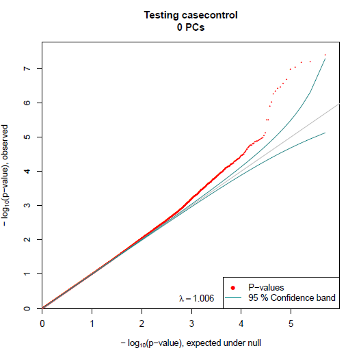
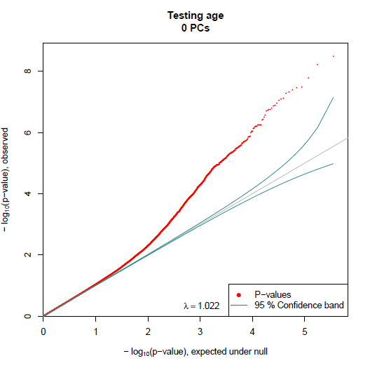
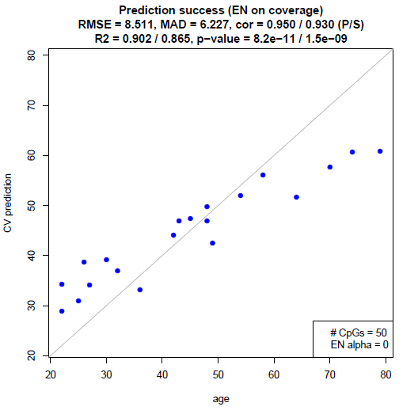

```{r switcher, echo=FALSE}
library('knitr')
# opts_chunk$set(eval=FALSE)
```

# Introduction

[RaMWAS](http://www.bioconductor.org/packages/devel/bioc/html/ramwas.html)
provides a complete toolset for methylome-wide association studies (MWAS).
It is specifically designed for data from enrichment based methylation assays,
but can be applied to other methylomic data as well.

The analysis pipeline includes seven steps:

1. Scanning aligned reads from BAM files
2. Calculation of quality control measures
3. Creation of methylation score (coverage) matrix
4. Principal component analysis for capturing batch effects and
   dentify outliers
5. Association analysis with respect to phenotypes of interest
   while correcting for top PCs and known covariates
6. Annotation of significant findings
7. Multi-marker analysis (methylation risk score) using elastic net

Most steps of RaMWAS are internally parallelized.
This is made possible, in part, by the use of
[filematrix](https://cran.r-project.org/web/packages/filematrix/index.html)
package for storing the data and accessing it in parallel jobs.

# Getting Started

## Installation

RaMWAS can be installed with the following commands.

```{r install, eval=FALSE}
## try http:// if https:// URLs are not supported
source("http://bioconductor.org/biocLite.R")
biocLite("ramwas")
```

## Loading Package and Viewing Documentation

The package vignettes and reference manual can be viewed
[online](http://www.bioconductor.org/packages/devel/bioc/html/ramwas.html)
and with following commands:

```{r loadIt, eval=FALSE}
library(ramwas) # Loads the package
browseVignettes('ramwas') # Opens vignettes
help(package="ramwas") # Lists package functions
```

# Steps of the Pipeline

To illustrate the workflow of RaMWAS we need a data set.
We use the function `ramwas0createArtificialData` to create an artificial
CpG set and a number of BAM files.

```{r loadPackages, echo=FALSE, warning=FALSE, message=FALSE}
suppressPackageStartupMessages(library(ramwas))
```

```{r generateData, warning=FALSE}
library(ramwas)
# dr = paste0(tempdir(), "/simulated_project");
dr = 'D:/temp'

ramwas0createArtificialData(dir = dr, verbose = FALSE)
# This is the project directory
cat(dr)
```

**Note.** One may choose to set the project directory `dr` to
a more convenient location when running this code.

Now the project directory `dr` contains

* `bams` - directory with the simulated BAM files
* `bam_list.txt` - file with names of all the BAM files
* `covariates.txt` - file with phenotype/covariate information,
here including age and sex.\
For a selected number of CpGs the methylation level
is simulated to depend on one of the two covaraites
* `Simulated_chromosome.rds` - file with locations of all CpGs.
See [CpG set vignette](RW4_CpG_sets.html) for more information.

Each RaMWAS step accepts parameters in the form of a list
with named elements.
A minimal parameter list below points RaMWAS to
the directories and files created above.

```{r parameters0}
param = list(
    dirproject = dr,
    dirbam = "bams",
    filebamlist = "bam_list.txt",
    filecpgset = "Simulated_chromosome.rds"
)
```

```{r cputhreads, echo=FALSE}
param$cputhreads = 2
```

## Step 1, Scan BAM Files

This step scans all BAM files listed in `filebamlist`
and calculates a number of quality control metrics.

The reads are filtered by `scoretag` parameter,
which is usually `MAPQ` field or `AS` tag.
The `minscore` parameter sets the minimum admissible score,
reads with scores below that are excluded.

```{r parameters1}
param$scoretag = "MAPQ"
param$minscore = 4
```

The `minfragmentsize` and `maxfragmentsize` parameters define
the minimum and maximum size of DNA fragments that were sequenced.
Please note, these parameters are not equal to the read length but
instead reflect the length of the DNA fragments that were
extracted and sequenced. Thus, these parameters are determined by
labtechnical factors such as fragmentation procedure and size selection.


```{r parameters2}
param$minfragmentsize = 50
param$maxfragmentsize = 250
```

Now we run step 1 of RaMWAS.

```{r scan-bams, warning=FALSE, message=FALSE}
ramwas1scanBams(param)
```

This creates the following subdirectories in the project directory:

* `rds_rbam` -- directory with BAM read start locations,
one R data file per BAM.
* `rds_qc` -- directory with BAM quality control metrics,
one R data file per BAM.
* `qc/coverage_by_density` - plots showing average coverage at
a function of CpG density, one plot per BAM.\
  These plots illustrate the performance of enrichment protocol.
  It is a sign of good quality data if the shape of these
  plots is the same across BAMs.
* `qc/edit_distance` - plots showing distribution of edit distance, i.e.
number of mismatches between the read and the reference genome,
one plot per BAM.
* `qc/isolated_distance` - plots showing distribution of distances
from read starts to isolated CpGs, one plot per BAM. \
The CpGs are called isolated if they are located at least `maxfragmentsize`
basepairs away from other CpGs.
The distribution of reads around these CpGs is used later
for estimation of fragment size distribution.
* `qc/matched_length` - plots showing distribution of the length of the
reads aligned to the reference genome, one plot per BAM.
* `qc/score` - plots showing distribution of the score (`scoretag` parameter),
one plot per BAM.

Here is a sample `coverage_by_density` plot for the simulated data.
It shows higher average coverage for regions
with higher CpG densities, up to high CpG density level.


**Note.** If a BAM has already been scanned before,
it is not processed again.
This way it is fast to rerun Step 1 when additional samples have been sequenced.
This way it is easy to check sample quality before all the data is produced.

## Step 2, Collect QC Measures from Individual BAMs, Summarize by Samples

This step aggregates quality control metrics across all scanned BAM files,
produces a number of summary plots, and estimates fragment size distribution.

Often miultiple BAMs contain reads from the same sample.
To let RaMWAS know the BAM to sample correspondence
one can use `filebam2sample` parameter, which names the file with
information on how the BAMs are combined into samples.
Each line in `filebam2sample` has information on one sample.
If sample1 contains reads from bam1, bam2 and bam3, the line should be

> sample1=bam1,bam2,bam3

If the sample name matches the bam name, the line can simply contain that name:

> sample1

For our sample data, we assume that each BAM matches exacly one
sample with the same name.
Thus, the file used for the `filebamlist` parameter can be used also for
the `filebam2sample` parameter.

```{r parameters3}
# param$filebam2sample = "bam_list.txt"
```

Now we run step 2 of RaMWAS.

```{r collectQC1, warning=FALSE, message=FALSE}
ramwas2collectqc(param)
```

The following files and directories are created in the project directory:

* `Fragment_size_distribution.txt` - text file with estimated
fragment size distribution.
* `qc/Fragment_size_distribution_estimate.pdf` - plot showing both
estimated fragment size distribution and the distribution of distances
from read starts to isolated CpGs.\
Poor fit may indicate lab-techincal problems or incorrect selection
of `minfragmentsize` and `maxfragmentsize` parameters.
* Four directories with QC measures aggregated
    + `qc/summary_bams` - by BAMs
    + `qc/summary_bams_in_bam2sample` - by BAMs,
    but only those listed in `filebam2sample` parameter
    + `qc/summary_by_sample` - by sample
    + `qc/summary_total` - total across all BAMs.
* The directories listed above contain
    - `Summary_QC.txt` - table with a number of numerical QC measures,
    in an Excel friendly format.
    - `Summary_QC_R.txt` - table with a number of numerical QC measures,
    in an R friendly format.
    - `qclist.rds` - an R file with list of QC objects.
    - `Fig_hist_*.pdf` - histograms of several QC measures across samples.
    - `Fig_*.pdf` - PDF files with various QC plots, one page per BAM or sample,
    depending on the directory.

Here is an example of a good fit of estimated fragment size distribution.


**Note.** The fragment size distribution is estimated using all BAMs in
`filebam2sample` parameter (if defined).


## Step 3, Calculate Coverage Matrix

This step creates a coverage matrix, with measurements of local
methylation for all samples in `filebam2sample` and all CpGs in the CpG set
(`filecpgset` parameter).
The CpGs with low coverage are excluded based on two criteria.

* A CpG must have average equal or greater than the user specified
thresholds `minavgcpgcoverage` (default is 0.3).
* A CpG must have at least `minnonzerosamples` proportion of samples
with nonzero coverage\
  (default is 0.3, i.e. a CpG is preserved if at least 30\% of samples
  have non-zero coverage).

```{r parameters4}
param$minavgcpgcoverage = 0.3
param$minnonzerosamples = 0.3
```

The matrix is normalized to have the same average coverage for each sample.
The coverage matrix is stored in a file as a `filematrix` object.
See
[`filematrix`](https://cran.r-project.org/web/packages/filematrix/index.html)
package for format details.

Now we run step 3 of RaMWAS.

```{r normCoverage99, warning=FALSE, message=FALSE}
ramwas3NormalizedCoverage(param)
```

This step creates directory `coverage_norm_20` in the project directory
(20 is the number of samples) with the following files:

* `Coverage.*` - filematrix with the coverage for all samples and all
CpGs that passed the threshold.\
  Each row has coverage for a single sample.\
  Each column has coverage for a single CpG.
* `CpG_locations.*` - filematrix with the location of the CpGs
that passed the threshold.\
It has two columns - `chr` and `position`.
* `CpG_chromosome_names.txt` - file with chromosome names for the integer
column `chr` in `CpG_locations.*` filematrix.
* `raw_sample_sums.*` - filematrix with total coverage for each
sample before normalization.

**Note.** The temporary files are located in `dirtemp` directory,
which is "temp" subdirectory of `dircoveragenorm` by default.
For better performance for large projects set `dirtemp` to a
location on another hard drive.


## Step 4, Principal Component Analysis

This step performs principal component analysis (PCA) on the coverage matrix.

We run PCA with two goals in mind.
First, we aim to capture main directions of variation in the data
(after regressing out covariates) and correct for them in the
next steps of the analysis.
Second, the sample loadings of the first PCs can indicate
highly irregular samples which should be excluded.

The analysis can exclude variation explained by known
covariates by regressing them out from the coverage before PCA.
The covariates can be stored as a file `filecovariates` in a
tab-separated table format, with sample names in the first column.
The artificial dataset includes covariate file *covariates.txt*.

```{r parameters5}
param$filecovariates = "covariates.txt"
param$modelcovariates = NULL
```

The parameter `modelcovariates` names the covariates to account for before PCA.
To include no covariates set it to `NULL`.
To include several, list them as a vector `c("age","casecontrol")`.

Now we run step 4 of RaMWAS.
```{r pca99, warning=FALSE, message=FALSE}
ramwas4PCA(param)
```

This step creates subdirectory `PCA_00_cvrts` in the directory with
score matrix. The name of the subdirectory depends on `modelcovariates`.
The subdirectory includes:

* `covmat.rds` and `eigen.rds` - R files with covariance matrix and
its eigenvalue decomposition.
* `PC_values.txt` - principal components scores.
* `PC_loadings.txt` - sample loadings for the top 20 PCs.
* `PC_plot_covariates_removed.pdf` - plots of principal components scores
(i.e. \% variance explained, page 1) and
sample loadings for the top 40 PCs (pages 2+).
* `PC_vs_covariates_corr.txt` - correlations of principal components
with covariates (in `filecovariates` file).
* `PC_vs_covariates_pvalue.txt` - p-values for these correlations.

The PC plot for artificial data shows no strong components and
no outliers in the sample loadings:


## Step 5, Methylome-wide Association Study (MWAS)

This step tests for association between methylation coverage and the
outcome variable named by `modeloutcome` parameter.
The analysis corrects for covariates listed in `modelcovariates`
parameter and top `modelPCs` principal components.
The testing is performed using linear regression model.

```{r parameters6}
param$modeloutcome = "sex"
param$modelPCs = 0
```

Now we run step 5 of RaMWAS.
```{r mwas99, warning=FALSE, message=FALSE}
ramwas5MWAS(param)
```

This step creates a subdirectory in the PCA directory named
`Testing_casecontrol_0_PCs`. The name depends on `modeloutcome` and `modelPCs`.
The subdirectory includes:

* `QQ_plot.pdf` - QQ-plot with confidence band and inflation factor.
* `Top_tests.txt` - text file with top findings
(those passing `toppvthreshold` p-value threshold).
* `Stats_and_pvalues.*` - filematrix with MWAS results.
The columns include test statistic, p-value, and q-value.
The rows match the CpGs of the coverage matrix.
* `DegreesOfFreedom.txt` - file with the numbers of degrees of freedom for
the t- or F test used for testing.

For the simulated the QQ-plot shows moderate deviation from the
diagonal indicating weak signal across many CpGs.


To repeat MWAS with other parameters, just change the code above.
```{r mwas88, warning=FALSE, message=FALSE}
param$modeloutcome = "age"
param$modelPCs = 0
ramwas5MWAS(param)
```



**Note.** The title of the qqplot can be set with the parameter `qqplottitle`.


## Step 6, Cross Validation Assessment of Multi-Marker Elastic Net Model.

RaMWAS can perform N-fold cross-validation and assess performance of
elastic net applied to the top MWAS sites.
It aims to predict the outcome variable (`modeloutcomes` parameter)
using top `mmncpgs` CpGs from the MWAS.
The elastic net parameter alpha can be set with `mmalpha` parameter.
The number of folds `cvnfolds` in the N-fold cross validation is 10.

First, we run MWAS 10 times as part of the 10-fold cross validation.

```{r parameters7, warning=FALSE, message=FALSE}
param$modeloutcome = "age"
param$modelPCs = 0
param$cvnfolds = 10;
ramwas7ArunMWAS(param)
```

This creates `CV_10_folds` subdirectory in MWAS directory.
It contains 10 MWAS folders, each with different 10% of the samples
excluded from the analysis.

Then, `ramwas7BrunElasticNet` trains elastic net on the top CpGs from each of
10 MWASes and predicts the outcome variable for the remaing 10\% of the samples.
This procedure is then applied 10 times to have a prediction for every sample.

```{r cv1, warning=FALSE, message=FALSE}
param$mmalpha = 0;
param$mmncpgs = 50;
ramwas7BrunElasticNet(param)
```

This creates two files in the cross validation directory
with names incapsulating the parameters.

* `MMCVN_prediction_folds=10_CpGs=000050_alpha=0.txt` -
the table with true outcome and cross-validation prediction.
* `MMCVN_prediction_folds=10_CpGs=000050_alpha=0.pdf` -
scatterplot of true outcome vs. cross-validation prediction.




```{r cv2, warning=FALSE, message=FALSE}
param$mmalpha = 0;
param$mmncpgs = 10
ramwas7BrunElasticNet(param)
```

For the simulated data we get good prediction power even with only 10 top CpGs.


## Cleanup

Here we remove all the files created by the code above.
```{r clean}
# unlink(paste0(dr,"/*"), recursive=TRUE)
```

# Version information
```{r version, eval=TRUE}
sessionInfo()
```

