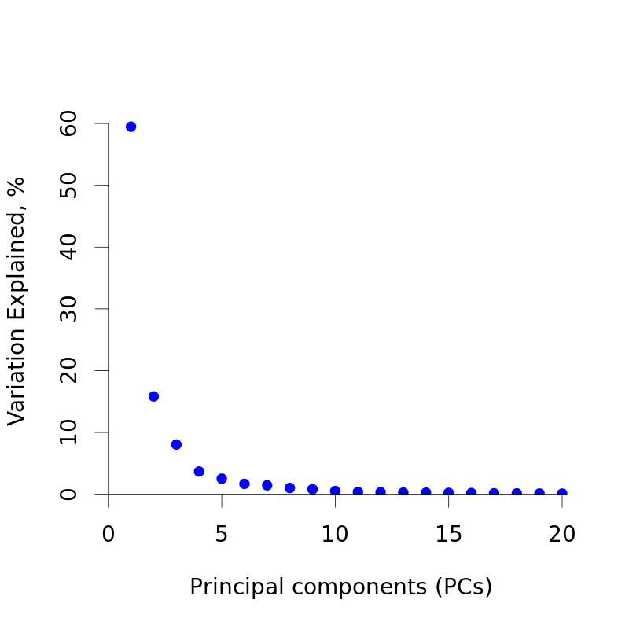
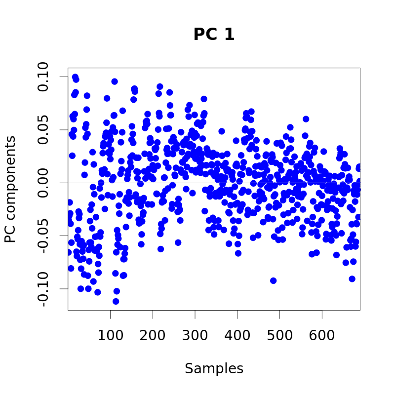
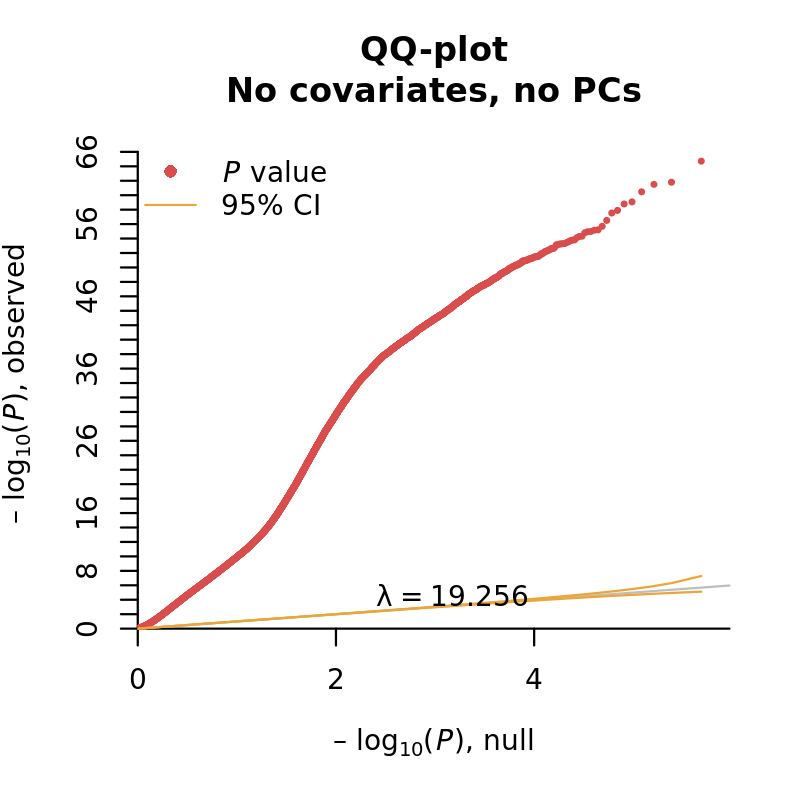
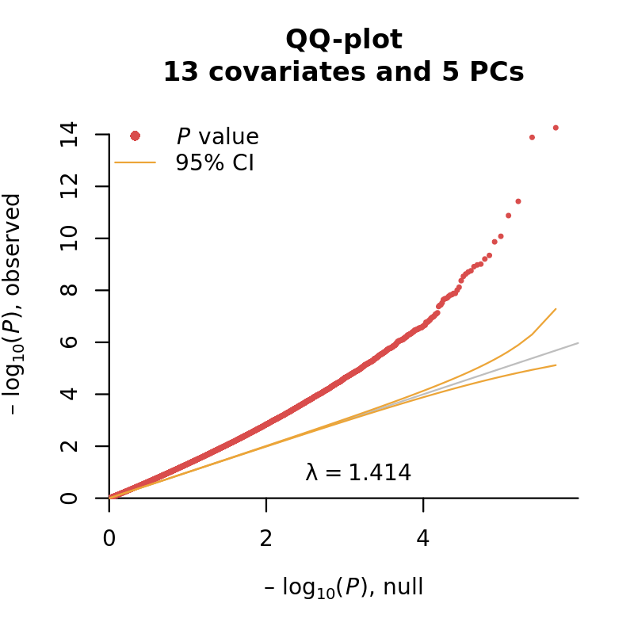

```{r loadPackages, echo=FALSE, warning=FALSE, message=FALSE}
library(knitr)
# library(pander)
# suppressPackageStartupMessages(library(ramwas))
# panderOptions("digits", 3)
# opts_chunk$set(fig.width = 6, fig.height = 6)
opts_chunk$set(eval=FALSE)
# setwd('F:/meth')
```

# Using RaMWAS with Illumina HumanMethylation450K or MethylationEPIC arrays

[RaMWAS](https://bioconductor.org/packages/ramwas/)
can be useful for the analysis of 
array-based methylation measurements from the Illumina HumanMethylation450K or
MethylationEPIC arrays.
RaMWAS can perform several quality control steps that are key to 
prevent test statistic inflation as well as downstream analyses such as 
principal component analysis (PCA), association testing (MWAS),
and multi-marker analysis with cross validation using the elastic net.

## Required packages

This vignette makes use of an number of CRAN and Bioconductor 
packages. The packages can be installed with the following command:

```{r prereq, eval=FALSE}
if (!requireNamespace("BiocManager", quietly = TRUE))
    install.packages("BiocManager")
BiocManager::install(c(
    "minfi",
    "IlluminaHumanMethylation450kmanifest",
    "IlluminaHumanMethylationEPICmanifest",
    "wateRmelon",
    "readxl",
    "RPMM",
    "FlowSorted.Blood.450k",
    "FlowSorted.Blood.EPIC"),
    update = TRUE, ask = FALSE, quiet = TRUE)
```


## Download example (public) data

Data from 450k/EPIC arrays can be imported in two ways: 

* from raw IDAT files or 
* from a file of methylation measures (beta or M-values).

For our example dataset,
we will use raw IDAT files from
[GSE42861](https://www.ncbi.nlm.nih.gov/geo/query/acc.cgi?acc=GSE42861).

First we download and untar the data.
Be sure the set the working directory to a preferred location with `setwd()`.
```{r downloadUnTAR}
download.file(
    url = 'https://www.ncbi.nlm.nih.gov/geo/download/?acc=GSE42861&format=file', 
    destfile = 'GSE42861_RAW.tar',
    quiet = TRUE,
    mode = 'wb')
untar('GSE42861_RAW.tar')
```

## Loading IDAT files

Now we use the `minfi` package to read the raw IDAT data files
into an `RGChannelSetExtended` object for downstream manipulation.

```{r load}
library(minfi)
download.file(  url = "http://shabal.in/RaMWAS/GSE42861_sampleSheet.csv", 
                destfile = "GSE42861_sampleSheet.csv",
                destfilemode = "wb")
targets = read.csv( file = "GSE42861_sampleSheet.csv", 
                    stringsAsFactors = FALSE)
rgSet = read.metharray.exp(
                    targets = targets,
                    extended = TRUE,
                    verbose = TRUE)
```

To go through the sample code quicker, one can choose to load
only a few samples by changing `targets = targets` to, say,
`targets = targets[1:20,]`. This would limit the example from 689 down to 20.

## Probe and sample level quality control

We exclude CpGs and samples based on a number of established criteria.

### Probes with SNPs and in cross-reactive regions

First,  we remove probes in cross-reactive regions
and those containing an SNP with minor allele frequency above 0.01 
within 10 bp of the single base extension position.

The lists of excluded probes depends on the platform. 
For Illumina HumanMethylation450k, we use the list provided by 
[Chen et al. (2013)](http://www.sickkids.ca/Research/Weksberg-Lab/Publications/index.html).
and for Illumina MethylationEPIC (a.k.a. 850k array) we use the list from
[Pidsley et al. (2016)](https://genomebiology.biomedcentral.com/articles/10.1186/s13059-016-1066-1).

The set of excluded probes is stored in `exclude.snp`.

```{r probes}
if( "IlluminaHumanMethylation450k" %in% rgSet@annotation ){
    host = "http://www.sickkids.ca/MS-Office-Files/Research/Weksberg%20Lab/"
    files = c(
        i450k_ns.xlsx = "48639-non-specific-probes-Illumina450k.xlsx",
        i450k_pl.xlsx = "48640-polymorphic-CpGs-Illumina450k.xlsx")

    for( i in seq_along(files) )
        download.file(
            url = paste0(host, files[i]),
            destfile = names(files)[i],
            mode = "wb",
            quiet = TRUE)
    
    library(readxl)
    ex1 = read_excel("i450k_ns.xlsx", sheet = 1)
    ex2 = read_excel("i450k_pl.xlsx", sheet = 1)
    ex3 = read_excel("i450k_pl.xlsx", sheet = 2)

    exclude.snp = unique(c(
                ex1$TargetID,
                ex2$PROBE,
                ex3$PROBE[ (ex3$BASE_FROM_SBE < 10) & (ex3$AF > 0.01)]))
    rm(host, files, i, ex1, ex2, ex3)
} else {
    host = "https://static-content.springer.com/esm/art%3A10.1186%2Fs13059-016-1066-1/MediaObjects/"
    files = c(
        S1_cross_reactive.csv     = '13059_2016_1066_MOESM1_ESM.csv',
        S4_snp_cpg.csv            = '13059_2016_1066_MOESM4_ESM.csv',
        S5_snp_base_extension.csv = '13059_2016_1066_MOESM5_ESM.csv',
        S6_snp_body.csv           = '13059_2016_1066_MOESM6_ESM.csv')
    
    for( i in seq_along(files) )
        download.file(
            url = paste0(host, files[i]),
            destfile = names(files)[i],
            mode = "wb",
            quiet = TRUE)

    snpcpgs1 = read.csv('S1_cross_reactive.csv', stringsAsFactors = FALSE)
    snpcpgs4 = read.csv('S4_snp_cpg.csv', stringsAsFactors = FALSE)
    snpcpgs5 = read.csv('S5_snp_base_extension.csv', stringsAsFactors = FALSE)
    snpcpgs6 = read.csv('S6_snp_body.csv', stringsAsFactors = FALSE)
    
    exclude.snp = unique(c(
        snpcpgs1$X,
        snpcpgs4$PROBE,
        snpcpgs5$PROBE,
        snpcpgs6$PROBE[
            pmax(snpcpgs6$VARIANT_START - snpcpgs6$MAPINFO, 
                 snpcpgs6$MAPINFO - snpcpgs6$VARIANT_END) < 10]))
    rm(host, files, i, snpcpgs1, snpcpgs4, snpcpgs5, snpcpgs6)
}
```

### Probes with low bead count

We also exclude CpGs with probes having less than 3 beads in 
more than 1\% of the samples
(in either red of green channel for Type I probes).

The set of probes is stored in `exclude.bds`.

```{r}
lb = getNBeads(rgSet) < 3
pi1 = getProbeInfo(rgSet, type = "I")
pi2 = getProbeInfo(rgSet, type = "II")
ex1 = pi1$Name[rowMeans(lb[pi1$AddressA,] | lb[pi1$AddressB,]) > 0.01]
ex2 = pi2$Name[rowMeans(lb[pi2$AddressA,]) > 0.01]
exclude.bds = unique(c(ex1, ex2))
rm(lb, pi1, pi2, ex1, ex2)
```

### Probes and samples with low detection p-values

We filter samples and probes using their detection p-values,
as calculated by the `detectionP` function in the `minfi` package.
In this example, 
samples are dropped if more than 1\% of the probes 
have a detection p-value over 1\%.
Probes are dropped if more than 1\% of the samples
have a detection p-value over 1\%.

The set of probes is stored in `exclude.bds` and
the set of good samples is stored in `keep.samples`.

```{r pv}
hp = detectionP(rgSet) > 0.01
exclude.hpv = rownames(hp)[rowMeans(hp) > 0.01]
keep.samples = colMeans(hp) < 0.01
rm(hp)
```

### Exclusion of low quality samples and probes

```{r exclude}
rgSet = subsetByLoci(
            rgSet = rgSet[,keep.samples],
            excludeLoci = c(exclude.snp, exclude.bds, exclude.hpv))
```

## Obtain methylation estimates and save in RaMWAS format

First, we obtain methylation estimates using one of many 
methods available in the `minfi` package.

```{r beta}
rgSetRaw = fixMethOutliers(preprocessRaw(rgSet))
# beta = BMIQ(rgSetRaw)
beta = getBeta(rgSetRaw)
```

Next, we save them in a file matrices following RaMWAS standards
(see [filematrix](https://CRAN.R-project.org/package=filematrix) package).
We create data files in the same format as produced by
[Step 3](RW1_intro.html#step3) of RaMWAS.

The files are saved in `rw` subdirectory.

```{r save}
dir.create('rw', showWarnings = FALSE)

rng = granges(mapToGenome(rgSet))
chr = seqnames(rng)

# Save CpG locations
library(filematrix)
locs = cbind(chr = as.integer(chr), position = start(rng))
fmloc = fm.create.from.matrix(
        filenamebase = paste0("rw/CpG_locations"),
        mat = locs,
        size = 4)
close(fmloc)
writeLines(con = 'rw/CpG_chromosome_names.txt', text = levels(chr))

# Save estimates
fm = fm.create.from.matrix(
        filenamebase = paste0("rw/Coverage"),
        mat = t(beta))
close(fm)
```

## Covariates for analysis

To avoid test statistic inflation, 
we first generate covariates that may capture technical artefacts for 
possible inclusion in the association tests. 
This list of covariates is then pruned to only those that
affect the methylation data 
to avoid unnecessary loss of degrees of freedom (i.e., power). 

### Principal components analysis (PCA) on control probes

We extract red and green channel for the control probes.

```{r pca1}
controlType = unique(getManifest(rgSet)@data$TypeControl$Type)
controlSet = getControlAddress(rgSet, controlType = controlType)
probeData = rbind(getRed(rgSet)[controlSet,], getGreen(rgSet)[controlSet,])
```

Next we run principal component analysis on the data after light normalization.

```{r pca2}
data = probeData - rowMeans(probeData)
covmat = crossprod(data)
eig = eigen(covmat)
```

The number of principal components included as covariates 
is usually determined by the scree plot.

```{r val}
library(ramwas)
plotPCvalues(eig$values, n = 20)
plotPCvectors(eig$vectors[,1], i = 1, col = 'blue')
```

```{r pplotpc, echo=FALSE}
png('PCval.png', 800, 800, pointsize = 28)
plotPCvalues(eig$values, n = 20)
dev.off()
png('PCvec.png', 800, 800, pointsize = 28)
plotPCvectors(eig$vectors[,1], i = 1, col = 'blue')
dev.off()
```


```{r cov.pca}
nPCs = 2
covariates.pca = eig$vectors[,seq_len(nPCs)]
colnames(covariates.pca) = paste0('PC',seq_len(nPCs))
rm(probeData, data, covmat, eig, nPCs) 
```

### Cell type composition

For DNA derived from whole blood, cord blood, or brain tissue,
we can estimate cellular proportions using the `estimateCellCounts()`
function in the `minfi` package.
In this example, we estimate cell proportions in blood.

```{r cell}
covariates.cel = estimateCellCounts(
                    rgSet = rgSet, 
                    compositeCellType = "Blood",
                    cellTypes = c("CD8T", "CD4T", "NK", 
                                  "Bcell", "Mono", "Gran"),
                    meanPlot = FALSE)
```

### Median methylated and unmethylated intensity

```{r umm}
covariates.umm = getQC(rgSetRaw)
```

### Phenotypic covariates from the sample sheet

We also add age, sex, case-control status, and other covariates from
the samples sheet to the covariate data frame.

```{r pheno}
rownames(targets) = targets$Basename;
targets$xSlide = paste0('x',targets$Slide) # Force Slide to be categorical
covariates.phe = targets[
            rownames(covariates.umm),
            c("xSlide", "Array", "caseStatus", "age", "sex", "smokingStatus")]
```

# Running RaMWAS on the data

## Set up parameters and covariates

To run PCA with RaMWAS we specify three parameters:

*   `dircoveragenorm` -- directory with the data matrix
*   `covariates` -- data frame with covariates
*   `modelcovariates` -- names of covariates to regress out

```{r param1}
covariates = data.frame(
                samples = rownames(covariates.umm),
                covariates.umm,
                covariates.pca,
                covariates.cel,
                covariates.phe)

library(ramwas)
param = ramwasParameters(
    dircoveragenorm = 'rw',
    covariates = covariates,
    modelcovariates = NULL,
    modeloutcome = "caseStatus",
    modelPCs = 0)
```

## Covariate pruning 

To avoid unnecessary loss of degrees of freedom (i.e., power) 
one should iteratively prune covariates prior to association testing
if they are not correlated with the top PCs of the methylation data.
During these iterations, the methylation data is residualized using
the included covariates prior to performing PCA so that the resulting PCs
only capture possible remaining sources of variation.

## MWAS without covariates (high inflation factor)

Performing MWAS without correction for any covariates
causes high inflation of the test statistics
(19.256 here, 15.17 in the original study).

```{r pcaNULL}
param$modelcovariates = NULL
param$modelPCs = 0
ramwas4PCA(param)
ramwas5MWAS(param)
qqPlotFast(getMWAS(param)$`p-value`)
title('QQ-plot\nNo covariates, no PCs')
```


## MWAS with all covariates (moderate inflation factor)

Inclusion of all covariates reduces the inflation of the test statistics
from 19.256 down to 1.182.

```{r pcaFULL}
param$modelcovariates = c(
    "age", "sex", "Array", "xSlide",
    "mMed", "uMed",
    "PC1", "PC2",
    "CD8T", "CD4T", "NK", "Bcell", "Mono", "Gran")
param$modelPCs = 2
ramwas4PCA(param)
ramwas5MWAS(param)
qqPlotFast(getMWAS(param)$`p-value`)
title('QQ-plot\n13 covariates and 2 PC')
```


```{r plotmwas, echo=FALSE}
png('QQnull.png', 800, 800, pointsize = 28)
param$modelcovariates = NULL
param$modelPCs = 0
mwas = getMWAS(param)
qqPlotFast(mwas$`p-value`)
title('QQ-plot\nNo covariates, no PCs')
dev.off()

png('QQfull.png', 800, 800, pointsize = 28)
param$modelcovariates = c(
    "age", "sex", "Array", "xSlide",
    "mMed", "uMed",
    "PC1", "PC2",
    "CD8T", "CD4T", "NK", "Bcell", "Mono", "Gran")
param$modelPCs = 2
mwas = getMWAS(param)
qqPlotFast(mwas$`p-value`)
title('QQ-plot\n13 covariates and 2 PCs')
dev.off()
```

## Further steps of RaMWAS pipeline

Steps 6 and 7 of the RaMWAS pipeline can also be applied
to the data matrix exactly as described in the
[overview vignette](RW1_intro.html#annotation-of-top-results).

